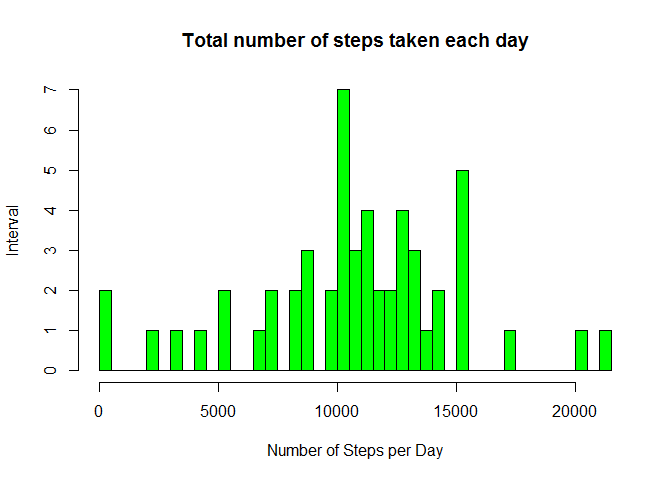
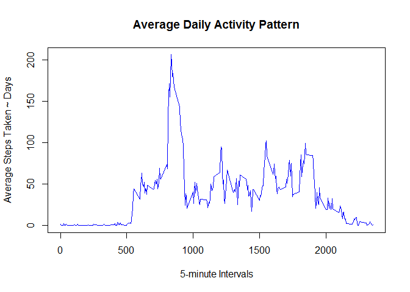
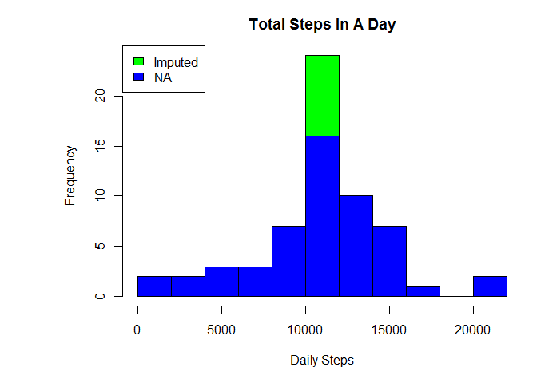
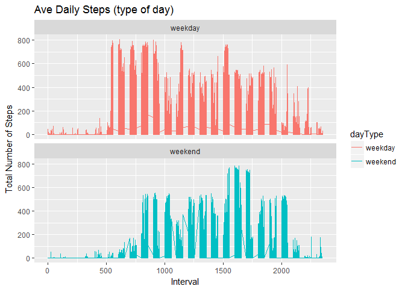

# PA1_template


#Loading and preprocessing the data
#==================================
Show any code that is needed to

1.Load the data (i.e. read.csv())

```r
setwd("C:/Manoj-H/docs/data science/JHU/5 - Reproducible_Research_Course_Notes/Week 2")
activity = read.csv("activity.csv", header=T, colClasses = c("integer", "character", "integer") ,sep = ",")
head(activity)
```

```
##   steps       date interval
## 1    NA 2012-10-01        0
## 2    NA 2012-10-01        5
## 3    NA 2012-10-01       10
## 4    NA 2012-10-01       15
## 5    NA 2012-10-01       20
## 6    NA 2012-10-01       25
```

2.Process/transform the data (if necessary) into a format suitable for your analysis

```r
activity$date <- as.Date(activity$date)

str(activity)
```

```
## 'data.frame':	17568 obs. of  3 variables:
##  $ steps   : int  NA NA NA NA NA NA NA NA NA NA ...
##  $ date    : Date, format: "2012-10-01" "2012-10-01" ...
##  $ interval: int  0 5 10 15 20 25 30 35 40 45 ...
```

```r
head(activity)
```

```
##   steps       date interval
## 1    NA 2012-10-01        0
## 2    NA 2012-10-01        5
## 3    NA 2012-10-01       10
## 4    NA 2012-10-01       15
## 5    NA 2012-10-01       20
## 6    NA 2012-10-01       25
```

#What is mean total number of steps taken per day?
#=================================================
For this part of the assignment, you can ignore the missing values in the dataset.

1. Calculate the total number of steps taken per day


```r
totalStepsPerDay <- aggregate(steps ~ date, activity,  FUN = sum, na.rm = TRUE)
head(totalStepsPerDay)
```

```
##         date steps
## 1 2012-10-02   126
## 2 2012-10-03 11352
## 3 2012-10-04 12116
## 4 2012-10-05 13294
## 5 2012-10-06 15420
## 6 2012-10-07 11015
```

2.If you do not understand the difference between a histogram and a barplot, research the difference between them. 
Make a histogram of the total number of steps taken each day


```r
hist(totalStepsPerDay$steps, 
     main="Total number of steps taken each day", 
     xlab="Number of Steps per Day", 
     ylab="Interval",
     border="black", 
     col="green",
breaks =50)
```

<!-- -->


3.Calculate and report the mean and median of the total number of steps taken per day

```r
mean(totalStepsPerDay$steps)
```

```
## [1] 10766.19
```

```r
median(totalStepsPerDay$steps)
```

```
## [1] 10765
```

#What is the average daily activity pattern?
#============================================

1. Make a time series plot (i.e. type = "l") of the 5-minute interval (x-axis) and 
the average number of steps taken, averaged across all days (y-axis)


```r
avgDailyActivity5MinInt <- aggregate(steps ~ interval, activity, FUN = mean, na.rm = TRUE)
colnames(avgDailyActivity5MinInt) <- c("interval", "avg")

str(avgDailyActivity5MinInt)
```

```
## 'data.frame':	288 obs. of  2 variables:
##  $ interval: int  0 5 10 15 20 25 30 35 40 45 ...
##  $ avg     : num  1.717 0.3396 0.1321 0.1509 0.0755 ...
```

```r
plot(x = avgDailyActivity5MinInt$interval, 
    y = avgDailyActivity5MinInt$avg, 
    type = "l", 
    col = "Blue",
    xlab = "5-minute Intervals",
    ylab = "Average Steps Taken ~ Days",
    main = "Average Daily Activity Pattern")
```

<!-- -->

2.Which 5-minute interval, on average across all the days in the dataset, contains the maximum number of steps?


```r
maxSteps <- max(avgDailyActivity5MinInt$avg)
avgDailyActivity5MinInt[avgDailyActivity5MinInt$avg == maxSteps, ]
```

```
##     interval      avg
## 104      835 206.1698
```

The interval with the largest average number steps was at 835 and an average of 206 steps.

#Imputing missing values
#========================

Note that there are a number of days/intervals where there are missing values (coded as NA). The presence of missing days may introduce bias 
into some calculations or summaries of the data.

1. Calculate and report the total number of missing values in the dataset (i.e. the total number of rows with NAs)


```r
sum(is.na(activity$steps))
```

```
## [1] 2304
```

The total number of NA’s | missing values in the dataset is 2304.

2. Devise a strategy for filling in all of the missing values in the dataset. The strategy does not need to be sophisticated. 
For example, you could use the mean/median for that day, or the mean for that 5-minute interval, etc.

add mean for that 5-minute interval

3.Create a new dataset that is equal to the original dataset but with the missing data filled in.


```r
activityComplete <- subset(activity, !is.na(activity$steps))
activityImp <- activity
activityNull <- is.na(activity$steps)
tAvg <- tapply(activityComplete$steps, activityComplete$interval, mean, na.rm = TRUE, simplify = T)
activityImp$steps[activityNull] <- tAvg[as.character(activityImp$interval[activityNull])]
```

4.Make a histogram of the total number of steps taken each day 
and Calculate and report the mean and median total number of steps taken per day. 
Do these values differ from the estimates from the first part of the assignment? 
What is the impact of imputing missing data on the estimates of the total daily number of steps?


```r
totalStepsperdayImp <- aggregate(steps ~ date, activityImp, FUN = sum)
 par(mar = c(5,8,3,1))

hist(totalStepsperdayImp$steps, breaks = 10, col = "green", xlab = "Daily Steps", main = "Total Steps In A Day")
hist(totalStepsPerDay$steps, breaks = 10, col = "blue", xlab = "Daily Steps", main = "Total Steps In A Day", add=T) 
legend("topleft", c("Imputed", "NA"), fill = c("green","blue"))
```

<!-- -->

```r
mean(totalStepsPerDay$steps)
```

```
## [1] 10766.19
```

```r
mean(totalStepsperdayImp$steps)
```

```
## [1] 10766.19
```

```r
median(totalStepsPerDay$steps)
```

```
## [1] 10765
```

```r
median(totalStepsperdayImp$steps)
```

```
## [1] 10766.19
```

Yes both means seemed to remain the same but the median after imputing slightly raised.

#Are there differences in activity patterns between weekdays and weekends?
###########################################################################

For this part the weekdays() function may be of some help here. Use the dataset with the filled-in missing values for this part.

1. Create a new factor variable in the dataset with two levels – “weekday” and “weekend” indicating whether a given date is a weekday or 
weekend day.


```r
activityImp$date <- as.Date(activityImp$date)
activityImp$day <- weekdays(activityImp$date)
activityImp$dayType <- as.factor(ifelse(activityImp$day == "Saturday" | activityImp$day == "Sunday", "weekend", "weekday"))

head(activityImp)
```

```
##       steps       date interval    day dayType
## 1 1.7169811 2012-10-01        0 Monday weekday
## 2 0.3396226 2012-10-01        5 Monday weekday
## 3 0.1320755 2012-10-01       10 Monday weekday
## 4 0.1509434 2012-10-01       15 Monday weekday
## 5 0.0754717 2012-10-01       20 Monday weekday
## 6 2.0943396 2012-10-01       25 Monday weekday
```

2.Make a panel plot containing a time series plot (i.e. type = "l") of the 5-minute interval (x-axis) and the average number of steps taken, 
averaged across all weekday days or weekend days (y-axis). See the README file in the GitHub repository to see an example of 
what this plot should look like using simulated data.


```r
avgDailyActivity5MinIntImp<- aggregate(steps ~ interval, data = activityImp, FUN = mean, na.rm = TRUE)
head(avgDailyActivity5MinIntImp)
```

```
##   interval     steps
## 1        0 1.7169811
## 2        5 0.3396226
## 3       10 0.1320755
## 4       15 0.1509434
## 5       20 0.0754717
## 6       25 2.0943396
```

```r
ggplot(activityImp, aes(x =interval , y=steps, color=dayType)) +       geom_line() +
       labs(title = "Ave Daily Steps (type of day)", x = "Interval", y = "Total Number of Steps") +
       facet_wrap(~ dayType, ncol = 1, nrow=2)
```

<!-- -->
